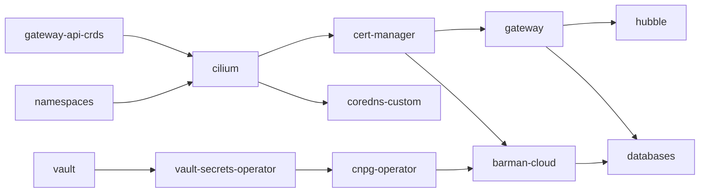

# First-Time Setup Instructions

These detailed instructions are the product of repeated experimentation with cluster design, shell scripting, and best practices for cluster security. This process was produced with the assistance of artificial intelligence.

This setup workflow is designed to be completed sequentially. Deviating from this order may result in initialization failures.

## Prerequisites

**Host tooling:** All tools available as open source software, recommend install in runtime environment for the cluster: Flux CLI, OpenTofu, `postgresql-client`, and GitHub access to the repo, and for `flux bootstrap`.

```bash
sudo apt install -y postgresql-client-common postgresql-client
curl -s https://fluxcd.io/install.sh | sudo bash
flux check --pre
gh auth status

curl --proto '=https' --tlsv1.2 -fsSL https://get.opentofu.org/install-opentofu.sh -o install-opentofu.sh
chmod +x install-opentofu.sh
sudo ./install-opentofu.sh --install-method standalone
rm install-opentofu.sh
tofu version
```

**Host firewall (`ufw`):** If `ufw` is active, its default-deny `INPUT`/`FORWARD` policies block Cilium outright, no CNI misconfiguration involved, the packets are just dropped by the host firewall before Cilium ever sees them. This surfaces later as pod-to-host timeouts, or Hubble Relay's startup probe failing with `NOT_SERVING`, which looks like a Cilium/TLS problem but isn't. Fix this now rather than debugging Cilium later:

```bash
sudo ufw allow in on cilium_host
sudo ufw allow in on cilium_net
sudo ufw allow in on cilium_vxlan
sudo ufw allow in on lxc+
sudo sed -i 's/DEFAULT_FORWARD_POLICY="DROP"/DEFAULT_FORWARD_POLICY="ACCEPT"/' /etc/default/ufw
sudo ufw reload
```

**Check:**

```bash
sudo ufw status verbose
# Default: ... allow (routed)
# cilium_host, cilium_net, cilium_vxlan, lxc+ all ALLOW IN
```

---

## 1. Clone repo and install k3s

* **Clone the repo to your remote branch:**

```bash
git clone https://github.com/DragonBishop/data_science_cluster.git
cd data_science_cluster
```

* **Confirm the network-specific values fit this rollout.**

*Reinstalling on a host that already has k3s installed?* Run `/usr/local/bin/k3s-uninstall.sh`, then check Cilium's BPF mounts are actually gone (`mount | grep bpf`; see `troubleshooting.md`). This wipes the in-cluster Vault and PVC data — SeaweedFS and the host Transit Vault live outside k3s's data dir and survive — so plan to rebuild Vault (Section 4+) and restore Postgres (README) afterward.

The IP and DNS structure for this cluster assumes generic IP routing on a Linux OS. These network values — `GATEWAY_IP`, `CILIUM_VERSION`, `COREDNS_LAN_IP`, `HOST_IP` — live in a `cluster-config` Secret in the `flux-system` namespace, substituted into every manifest below via Flux's `postBuild.substituteFrom` (see the `clusters/local/*.yaml` Kustomization for each). The Secret itself is never committed to git; `terraform/cluster-config/` creates it via OpenTofu from a `terraform.tfvars` file you provide (gitignored). This needs `kubectl` to reach the cluster's API server, so it runs once k3s is installed below — no need to wait for Cilium, the API server answers before the CNI is ready.

| File | Sourced from `cluster-config` |
| --- | --- |
| `infrastructure/cilium/lan-lb-pool.yaml` | `${GATEWAY_IP}` as the pool's `start` (the `stop`, `192.0.2.250`, is still a plain literal — it's not duplicated anywhere else) |
| `infrastructure/gateway/gateway.yaml` | `${GATEWAY_IP}` — the shared Gateway's IP |
| `apps/databases/postgis-tls.yaml` | `${GATEWAY_IP}` again, as a cert SAN |
| `infrastructure/coredns-custom/coredns-lan-service.yaml` | `${COREDNS_LAN_IP}` — the LAN-facing IP for k3s's own CoreDNS |
| `infrastructure/coredns-custom/coredns-custom.yaml` | `${GATEWAY_IP}` — what every `*.internal` name resolves to |
| `infrastructure/cilium/cilium-release.yaml` | `${CILIUM_VERSION}` — the HelmRelease chart version |
| `infrastructure/vault/vault-networkpolicy.yaml` | `${HOST_IP}` — the node's own address, for Vault's egress to the host Transit Vault |

To change any of these (a new LAN IP, a Cilium upgrade), update `terraform.tfvars` and run `tofu apply` again — don't edit the individual manifests.

k3s's own in-cluster CoreDNS (`kube-system`) resolves `*.internal` for LAN clients (via `infrastructure/coredns-custom/`, a zone added to the same CoreDNS that's always resolved `*.svc.cluster.local` for pods — not a second resolver). Whether your devices actually reach it depends on your router/DNS setup, covered later in this doc.

Confirm your router's DHCP scope excludes the whole reserved block, not just the addresses currently in use:

```bash
ping -c 2 -W 1 192.0.2.240
ping -c 2 -W 1 192.0.2.242
```

No response means the address is likely free, not that the router will never hand it out. DHCP exclusion of the full `192.0.2.240-192.0.2.250` range is what guarantees that.

**Install k3s.** Cilium replaces kube-proxy, Traefik, servicelb, and the default CNI, so the flags below disable all of them. They live in `/etc/rancher/k3s/config.yaml`, which k3s reads automatically on every `k3s server` invocation regardless of how it's started (install, systemd, or `start-cluster.sh`'s own `nohup` launch) — one file instead of hand-keeping the same flags in sync across multiple places:

```bash
mkdir -p ~/.kube

sudo mkdir -p /etc/rancher/k3s
printf 'write-kubeconfig-mode: "644"\nwrite-kubeconfig: %s/.kube/config\ndisable:\n  - traefik\n  - servicelb\ndisable-kube-proxy: true\ndisable-network-policy: true\nflannel-backend: none\nsecrets-encryption: true\n' "$HOME" | sudo tee /etc/rancher/k3s/config.yaml > /dev/null

curl -sfL https://get.k3s.io | sh -

kubectl get nodes
```

* **Check:** node shows up, status `NotReady`. Don't panic! This is expected because until Cilium is operational, there is no CNI for the container.

* **Create the `cluster-config` Secret.** `kubectl` already reaches the API server at this point, even though the node itself is `NotReady`:

```bash
cd terraform/cluster-config
cat > terraform.tfvars <<'EOF'
gateway_ip     = "192.0.2.240"
coredns_lan_ip = "192.0.2.242"
host_ip        = "<this node's own LAN IP, e.g. from `ip addr` or `hostname -I`>"
cilium_version = "1.20.0"
EOF
tofu init
tofu apply
cd ../..
```

* **Check:**

```bash
kubectl get secret cluster-config -n flux-system
```

---

## 2. Cilium

The Gateway API Controller Resource Definitions (CRDs) must be installed before Cilium. Carefully review the compatibility of both resources before deploying. A mismatch leaves the GatewayClass in an `ACCEPTED: Unknown` state rather than reporting an error. This deployment uses the standard (GA) release channel. Use Flux to roll out upgrades to Cilium once the cluster is fully assembled.

```bash
kubectl apply --server-side -f infrastructure/gateway-api-crds/standard-install.yaml
```

`--server-side` records field ownership under a named manager, so Flux can reconcile these CRDs later without a conflict.

Version comes from `infrastructure/cilium/cilium-release.yaml` — the same version the Flux `HelmRelease` adopts later, so this bootstrap install and the in-git release never disagree:

```bash
CILIUM_VERSION=$(grep 'version:' infrastructure/cilium/cilium-release.yaml | tr -d ' "' | cut -d: -f2)
helm upgrade --install cilium oci://quay.io/cilium/charts/cilium --version "$CILIUM_VERSION" \
  --namespace kube-system --create-namespace \
  -f infrastructure/cilium/cilium-values.yaml \
  --atomic --timeout 5m
```

`--atomic` rolls the release back automatically if it fails to become ready within the timeout.

**Check:**

```bash
kubectl get nodes                          # Ready
cilium status --wait
kubectl -n kube-system exec ds/cilium -- cilium-dbg status | grep KubeProxyReplacement
# KubeProxyReplacement: True

kubectl -n kube-system get cm cilium-config -o yaml | grep enable-l2-announcements
kubectl -n kube-system exec ds/cilium -- cilium-dbg status --verbose | grep -A2 l2-responder
# enable-l2-announcements: "true", l2-responder [OK] Running
```

---

## 3. Deploy the Host-Level Transit Vault

This Vault instance runs directly on the host and unseals the cluster's Main Vault.

```bash
wget -O- https://apt.releases.hashicorp.com/gpg | sudo gpg --dearmor -o /usr/share/keyrings/hashicorp-archive-keyring.gpg

echo "deb [signed-by=/usr/share/keyrings/hashicorp-archive-keyring.gpg] https://apt.releases.hashicorp.com $(lsb_release -cs) main" | sudo tee /etc/apt/sources.list.d/hashicorp.list

sudo apt update && sudo apt install -y vault
```

Generate the TLS certificate the in-cluster Vault verifies:

```bash
sudo openssl req -x509 -newkey rsa:4096 -sha256 -days 3650 -nodes \
  -keyout /opt/vault/tls/tls.key \
  -out /opt/vault/tls/tls.crt \
  -subj "/CN=vault.local" \
  -addext "subjectAltName=DNS:vault.local,DNS:localhost,IP:127.0.0.1"
sudo chown vault:vault /opt/vault/tls/tls.key /opt/vault/tls/tls.crt
sudo chmod 640 /opt/vault/tls/tls.key
sudo chmod 644 /opt/vault/tls/tls.crt
sudo chmod o+x /opt/vault/tls
```

The certificate carries `vault.local` rather than the host's IP. Add `127.0.0.1 vault.local` to `/etc/hosts`. The in-cluster Main Vault connects to Transit by IP. `vault-values.yaml`'s seal `address`, substituted from the Downward API at every pod start, verifies the certificate against the `vault.local` name through `tls_server_name`, so an IP change requires no cert or config update.

Modify `/etc/vault.d/vault.hcl`. Bind the listener to `0.0.0.0:8200` so the cluster can reach it, and define `api_addr`:

```hcl
api_addr = "https://vault.local:8200"

listener "tcp" {
  address       = "0.0.0.0:8200"
  tls_cert_file = "/opt/vault/tls/tls.crt"
  tls_key_file  = "/opt/vault/tls/tls.key"
}
```

Enable the service and initialize Vault:

```bash
sudo systemctl enable --now vault

export VAULT_ADDR="https://127.0.0.1:8200"
export VAULT_CACERT="/opt/vault/tls/tls.crt"
vault operator init
```

CRITICAL: Store the generated 5 Unseal Keys and 1 Initial Root Token in a secure password manager immediately. If lost, data is irrecoverable.

Unseal the Transit Vault by providing three different unseal keys:

`vault operator unseal`

Then use the initial root token given to you by the vault to login:

`vault login`

The transit secrets engine, its `autounseal` key, the `autounseal-policy`, and the periodic orphan token that authorizes the in-cluster Vault to use it are all created by the OpenTofu module at `terraform/vault-transit-bootstrap/`, run in Section 5 once the `vault` namespace exists for it to write into — nothing to do here. That module also sets up continuous renewal via a `vault-agent-autounseal` systemd service, so the token never needs manual reissuing regardless of how long the cluster stays down.

**Automating future unseals (one-time setup):**

The Transit Vault re-seals on every host reboot, which would otherwise mean re-running the three `vault operator unseal` calls by hand each time. `src/bash/start-cluster.sh` decrypts the three keys from a GPG-encrypted keyfile behind a single passphrase.

Generate the keyfile once, from a RAM-backed tmpfs so the plaintext keys never touch disk:

```bash
mkdir -p /dev/shm/vault-setup && cd /dev/shm/vault-setup

# There's a few ways to paste the same 3 keys used above into keys.txt
# But Nano allows double checking your work:
sudo nano keys.txt

gpg --batch --yes --cipher-algo AES256 --symmetric keys.txt
mv keys.txt.gpg ~/.vault-keys.gpg
chmod 600 ~/.vault-keys.gpg
cd / && rm -rf /dev/shm/vault-setup
```

Set the GPG passphrase cache to expire immediately, so it does not persist past the unseal:

```bash
cat >> ~/.gnupg/gpg-agent.conf <<'EOF'
default-cache-ttl 0
max-cache-ttl 0
EOF
gpgconf --reload gpg-agent
```

From this point on, `src/bash/start-cluster.sh` checks whether the Transit Vault is sealed and prompts for this passphrase when it is.

---

## 4. Bootstrap Flux

This writes `clusters/local/flux-system/` and pushes its own commit.

```bash
flux bootstrap github \
  --owner=DragonBishop \
  --repository=data_science_cluster \
  --branch=main \
  --path=clusters/local \
  --personal
```

Once Flux's first sync completes it starts walking the full dependency graph — one Kustomization per directory under `infrastructure/`/`apps/`, `dependsOn`-chained into the install order the cluster actually needs:



* `cilium` needs `gateway-api-crds` (its `GatewayClass`) and `namespaces` (`cert-manager`/`gateway`/etc. need somewhere to live) ready first.
* `cnpg-operator` also needs `cert-manager` via `barman-cloud`'s own `dependsOn`.
* `gateway` holds the one shared `Gateway` every tool's `Route` attaches to, plus the CA chain its Certificate uses. `databases` depends on it for `postgis-tcproute.yaml`'s cross-namespace attach.
* `coredns-custom` just needs `cilium`, for the LB IP its LAN-facing Service claims.

**Check:**

```bash
flux get kustomizations
kubectl get pods -n flux-system   # all Running
kubectl get ns
# vault, vso-system, cnpg-system, databases,
# cert-manager, gateway
```

---

## 5. Deploy k3s Hashicorp Vault

**What `vault-values.yaml` references**, before Flux reconciles Vault's `Kustomization`. These commands talk to the **host** Transit Vault, so `VAULT_ADDR`/`VAULT_CACERT` must point at it, not the in-cluster one:

```bash
export VAULT_ADDR="https://127.0.0.1:8200"
export VAULT_CACERT="/opt/vault/tls/tls.crt"
vault status   # Sealed: true means unseal it first
```

If sealed, decrypt three of the five Shamir keys from the GPG keyfile (the same mechanism `src/bash/start-cluster.sh` uses). This needs your GPG passphrase at an interactive `pinentry` prompt. Run it in your own terminal:

```bash
gpg --quiet --decrypt "$HOME/.vault-keys.gpg" | while IFS= read -r key; do
    [ -n "$key" ] || continue
    printf '%s\n' "$key" | vault write sys/unseal key=-
done
vault status   # expect Sealed: false
```

`VAULT_TOKEN` authenticates the module's `vault` provider — `provider.tf` points it at the host Transit Vault (`127.0.0.1:8200`) but sets no `token`, so the provider falls back to this env var.

`TF_VAR_state_encryption_passphrase` feeds `encryption.tf`'s `pbkdf2`/`aes_gcm` blocks, which encrypt the OpenTofu state file at rest — prompting for it instead of hardcoding it keeps the passphrase out of the state and the shell history.

`tofu apply` then creates everything the in-cluster Vault's auto-unseal depends on:

* The `transit` mount and `autounseal` key (`token.tf`).
* The `autounseal-policy`, scoping it to just `transit/encrypt|decrypt/autounseal` (`policy.tf`).
* The periodic orphan token, on a 768h renewal period (`token.tf`).
* The `vault-transit-secret`/`vault-transit-ca` Kubernetes objects the in-cluster Vault reads, written into the `vault` namespace (`kubernetes-secrets.tf` — that namespace already exists via Flux's `infrastructure/namespaces/namespaces.yaml`, so the module doesn't create it).

Both env vars are `unset` afterward, since neither should outlive this shell:

```bash
export VAULT_TOKEN=$(cat ~/.vault-token)
read -rs -p "State encryption passphrase: " TF_VAR_state_encryption_passphrase; echo
export TF_VAR_state_encryption_passphrase

cd terraform/vault-transit-bootstrap
tofu init
tofu apply

unset VAULT_TOKEN TF_VAR_state_encryption_passphrase
cd ../..
```

**Set up continuous token renewal (one-time setup):** the token Tofu just created is periodic (768h / 32 days) and needs renewing before it expires — independent of whether the cluster, or even k3s, is running. A `vault-agent-autounseal` systemd service handles this permanently in the background, reading the token Tofu also wrote to `~/.vault-agent/autounseal-token` and calling `renew-self` on it for as long as the service runs:

```bash
printf 'vault {\n  address = "https://127.0.0.1:8200"\n  ca_cert = "/opt/vault/tls/tls.crt"\n}\nauto_auth {\n  method "token_file" {\n    config = { token_file_path = "%s/.vault-agent/autounseal-token" }\n  }\n}\n' "$HOME" | sudo tee /etc/vault-agent-autounseal.hcl > /dev/null

printf '[Unit]\nDescription=Vault Agent - transit auto-unseal token renewal\nAfter=vault.service\nRequires=vault.service\n\n[Service]\nExecStart=/usr/bin/vault agent -config=/etc/vault-agent-autounseal.hcl\nRestart=on-failure\n\n[Install]\nWantedBy=multi-user.target\n' | sudo tee /etc/systemd/system/vault-agent-autounseal.service > /dev/null

sudo systemctl daemon-reload
sudo systemctl enable --now vault-agent-autounseal
systemctl status vault-agent-autounseal   # active (running)
```

The token's value never changes on renewal (only its TTL does), so `vault-transit-secret` — written once by the Tofu apply above — never needs touching again either.

**Reconcile Vault:**

```bash
flux reconcile kustomization vault
kubectl get pods -n vault -w
```

**Check:** `vault-0` reaches `Running` on the first attempt.

Initialize this instance. Because the seal is transit, this returns **recovery keys** and a **root token**, not unseal keys. Store both immediately:

```bash
kubectl exec -n vault vault-0 -- vault operator init
```

**Configure it completely:** KV secrets, the Kubernetes auth backend, policies via the OpenTofu module at `terraform/vault-bootstrap/`. Flux never reconciles this directory; state is local, gitignored, and encrypted at rest via OpenTofu's `encryption` block. Generate the state-encryption passphrase once and store it alongside the recovery keys.

Generate a passphrase using the bash terminal:

```bash
openssl rand -base64 32
```

Port-forward the in-cluster Vault to 8210 (8200 is already taken by the host Transit Vault), then save its CA cert locally so `tofu apply` can verify TLS against it:

```bash
kubectl port-forward -n vault vault-0 8210:8200 &

mkdir -p ~/.vault-certs
kubectl get secret vault-server-cert -n vault -o jsonpath='{.data.ca\.crt}' | base64 -d > ~/.vault-certs/vault-internal-ca.crt

read -rs -p "Vault root token (above): " VAULT_TOKEN; echo
read -rs -p "State encryption passphrase: " TF_VAR_state_encryption_passphrase; echo
export VAULT_TOKEN TF_VAR_state_encryption_passphrase

export TF_VAR_postgres_superuser_password=$(openssl rand -base64 24)
export TF_VAR_s3_access_key=$(openssl rand -hex 10)
export TF_VAR_s3_secret_key=$(openssl rand -hex 20)

cd terraform/vault-bootstrap
tofu init
tofu apply
cd ../..
```

`tofu apply` writes the generated Postgres and S3 credentials into Vault's KV store, then sets up the Kubernetes auth backend so the `postgis-vault-auth` ServiceAccount in `databases` can read them back at runtime.

Try to avoid passing secrets at any point in this project as plain-text. This bash script reads the secrets from the vault as environment variables, the ones it needs from the user it will prompt you for while hiding from the terminal.

`tofu apply` without `-auto-approve` pauses for an interactive `yes`. If that prompt scrolls out of view, check for a live `terraform-provider-vault` subprocess (`ps -ef | grep terraform-provider-vault`) before assuming it's hung. No such process, plus the parent `tofu` idling in `futex_do_wait`, means it's waiting on your `yes`.

**Check before unsetting anything:**

```bash
vault kv get secret/postgis
vault kv get secret/seaweedfs
head -c 200 terraform/vault-bootstrap/terraform.tfstate
```

The first two return what you just wrote. The third should be opaque/binary. Readable plaintext means the `encryption` block isn't taking effect; stop and report back.

```bash
unset VAULT_TOKEN TF_VAR_state_encryption_passphrase TF_VAR_postgres_superuser_password TF_VAR_s3_access_key TF_VAR_s3_secret_key
```

---

## 6. Flux Kustomization Rollout

Thanks to flux's `dependsOn` feature, we can roll out the bulk of the cluster in one fell swoop:

```bash
flux reconcile kustomization flux-system --with-source
# This rolls the majority of the cluster out in one dependency chain.
# SeaweedFS, CNPG, and Hubble all may take some time to come online as healthy.
```

**Check:**

```bash
flux get kustomizations
```

```bash
helm list -n kube-system  

 # release "cilium" shows REVISION 2 adopted, not reinstalled. A brand-new
 # release instead means releaseName/namespace didn't match and two Cilium
 # installs are fighting over the same CNI. Uninstall cilium completely, then
 # reinstall fresh.

kubectl get ciliumloadbalancerippool
# lan-ip-pool shows 2 IPs used (the shared Gateway's Service, coredns-external).

kubectl get gateway -n gateway internal-gateway -o wide
# ADDRESS 192.0.2.240, PROGRAMMED True

kubectl get svc -n kube-system coredns-external
# EXTERNAL-IP 192.0.2.242, not <pending>

# coredns-custom's ConfigMap volume is optional: true, so it isn't mounted
# retroactively into an already-running CoreDNS pod. First time only:
kubectl rollout restart deployment coredns -n kube-system

kubectl wait --for=condition=Available --timeout=120s -n cert-manager deployment --all

kubectl get clusterissuer gateway-ca-issuer   # Ready

kubectl rollout status deployment -n cnpg-system plugin-barman-cloud

kubectl get svc,pods -n databases -l app.kubernetes.io/instance=seaweedfs --show-labels
```

```bash
kubectl cnpg status postgis-cluster -n databases
```

The Cluster should be healthy, `1/1` ready, with WAL archiving working on the first attempt.

```bash
kubectl get clusterissuer hubble-ca-issuer   # Ready

helm get values cilium -n kube-system   # hubble: block present
kubectl get pods -n kube-system -l 'k8s-app in (hubble-relay,hubble-ui)'
# both Running, 1/1 and 2/2

kubectl get httproute -n kube-system hubble-ui -o jsonpath='{.status.parents[*].conditions[*].message}'
# "Accepted" and "Service reference is valid"
```

If the Hubble block hasn't shown up in `helm get values` yet, the watch can take a few seconds to catch the new ConfigMap. Force it rather than wait:

```bash
flux reconcile helmrelease cilium -n kube-system --timeout 5m
```

This does not restart the Cilium agent DaemonSet. only Relay/UI get created and Hubble's certs issued via cert-manager. If this instead reports `RetriesExceeded`/`Stalled` and returns immediately, a plain reconcile won't retry it, see `troubleshooting.md`.

**Direct CLI/UI access:** `just hubble-ui` port-forwards straight to `localhost:12000` and opens a browser — useful before `hubble.internal` resolves anywhere (see the DNS section below). `just hubble status` / `just hubble observe --follow` talk to Relay directly over its mTLS port (4245), separate from the HTTPRoute above: the Gateway carries the web UI's HTTP(S) traffic, not Relay's own gRPC port. See the `justfile`.

---

## 7. Deploy CloudNativePostgreSQL database server with postGIS extension

**Check, in order. Stop and debug on failures:**

```bash
kubectl cnpg status postgis-cluster -n databases
# Cluster in healthy state, 1/1 ready, WAL archiving OK

kubectl get database -n databases
# postgis-cluster/data-science, status.applied: true

kubectl exec -i postgis-cluster-1 -n databases -- psql -U postgres -d data_science -c '\dx'
# postgis, postgis_topology, postgis_tiger_geocoder, fuzzystrmatch

kubectl exec -i postgis-cluster-1 -n databases -- psql -U postgres -d postgres -c \
  "SELECT datname, pg_catalog.pg_get_userbyid(datdba) FROM pg_database WHERE datname='data_science';"
# owner is app_readwrite, not postgres

kubectl get tcproute -n databases postgis-external -o jsonpath='{.status.parents[*].conditions[*].message}'
# "Service reference is valid"
```

A valid `TCPRoute` reference confirms Kubernetes-level wiring, not LAN reachability, which needs an actual connection test using previously generated lease credentials.

```bash
LEASE_USER=$(kubectl get secret -n databases postgis-app-dynamic-credentials -o jsonpath='{.data.username}' | base64 -d)
LEASE_PASS=$(kubectl get secret -n databases postgis-app-dynamic-credentials -o jsonpath='{.data.password}' | base64 -d)
mkdir -p ~/.postgresql
kubectl get secret postgis-server-cert -n databases -o jsonpath='{.data.ca\.crt}' | base64 -d > ~/.postgresql/root.crt
PGPASSWORD="$LEASE_PASS" psql \
  "host=192.0.2.240 port=5432 dbname=data_science user=$LEASE_USER sslmode=verify-full" \
  -c 'SELECT current_user, session_user;'
unset LEASE_USER LEASE_PASS
```

If ARP doesn't resolve (`no route to host`, or `arping 192.0.2.240` from another LAN device gets nothing back), the likely cause on a consumer/office router is ARP or DHCP-snooping filtering unsolicited replies from an IP it never leased, not a Cilium misconfiguration.

**Migrating data from an existing Postgres instance?** Restore its dump into the freshly bootstrapped cluster below; skip if starting empty. (Restoring from *this* cluster's own CNPG/Barman backups instead — see README's [Restoring the Database from SeaweedFS](README.md#restoring-the-database-from-seaweedfs).)

```bash
kubectl exec -i postgis-cluster-1 -n databases -- pg_restore -U postgres -d data_science --no-owner --no-privileges \
  < /mnt/your/mount/path/data_science_backup_*.dump
```

`--no-owner --no-privileges`: the dump's objects were owned by `postgres` in the old cluster; here they should be owned by `app_readwrite`, per the existing grant/ownership model.

**Check:**

```bash
kubectl exec -i postgis-cluster-1 -n databases -- psql -U postgres -d data_science -c '\dn'
# gda_capstone_a_raw, google_data_analytics, public, statistics_with_python, tiger, topology
```

---

## 8. OpenTofu Role Configuration

`vault_database_secret_backend_connection` defaults `verify_connection = true`, so OpenTofu opens a connection to `postgis-cluster-rw.databases.svc.cluster.local:5432` at apply time. Which only resolves once Phase 6's Cluster is Ready. Module at `terraform/vault-database/`, with its own `.tfstate` and encryption:

```bash
kubectl port-forward -n vault vault-0 8210:8200 &

read -rs -p "Vault root token (Phase 4): " VAULT_TOKEN; echo
read -rs -p "State encryption passphrase: " TF_VAR_state_encryption_passphrase; echo
export VAULT_TOKEN TF_VAR_state_encryption_passphrase
export TF_VAR_postgres_superuser_password=$(VAULT_ADDR=https://127.0.0.1:8210 VAULT_CACERT=~/.vault-certs/vault-internal-ca.crt VAULT_TOKEN="$VAULT_TOKEN" vault kv get -field=password secret/postgis)

cd terraform/vault-database
tofu init
tofu apply
cd ../..
```

`postgres_superuser_password` must be the exact value Phase 4 wrote into `secret/postgis`. Read it back from Vault rather than retype it.

```bash
unset VAULT_TOKEN TF_VAR_state_encryption_passphrase TF_VAR_postgres_superuser_password
```

**Check:**

```bash
head -c 200 terraform/vault-database/terraform.tfstate   # opaque/binary

kubectl get vaultdynamicsecret postgis-app-dynamic-secret -n databases
kubectl exec -i postgis-cluster-1 -n databases -- psql -U postgres -d postgres -c '\du'
# the issued role shows Member of: app_readwrite

LEASE_USER=$(kubectl get secret -n databases postgis-app-dynamic-credentials -o jsonpath='{.data.username}' | base64 -d)
LEASE_PASS=$(kubectl get secret -n databases postgis-app-dynamic-credentials -o jsonpath='{.data.password}' | base64 -d)
PGPASSWORD="$LEASE_PASS" psql \
  "host=192.0.2.240 port=5432 dbname=data_science user=$LEASE_USER sslmode=verify-full" \
  -c 'SELECT current_user, session_user;'
unset LEASE_USER LEASE_PASS
```

Run this from the host, not `kubectl exec` as the `postgres` OS user inside the container has no `~/.postgresql/root.crt`, so `verify-full` fails there with a misleading "root certificate file ... does not exist" error.

---

## 9. Full end-to-end verification

```bash
kubectl cnpg status postgis-cluster -n databases        # healthy, WAL archiving OK
kubectl get scheduledbackup -n databases                 # suspend: false
kubectl cnpg backup postgis-cluster -n databases          # take one manually
kubectl cnpg status postgis-cluster -n databases          # Last Successful Backup updates
flux get kustomizations                                   # everything Ready
```

Rehearse a restore once, per the README's restore section. A restore path untested on the new build is unverified.

```bash
curl -v --resolve hubble.internal:443:192.0.2.240 \
  --cacert <(kubectl get secret -n cert-manager gateway-local-ca-secret -o jsonpath='{.data.tls\.crt}' | base64 -d) \
  https://hubble.internal/
```

`--resolve` bypasses DNS entirely, so this checks the Gateway/HTTPRoute/cert chain on its own, independent of whether `hubble.internal` actually resolves anywhere yet. If your devices are set up to resolve it (see the DNS section above), plain `curl https://hubble.internal/` should work the same way. Confirm the page loads and the certificate chains to `gateway-local-ca`.
