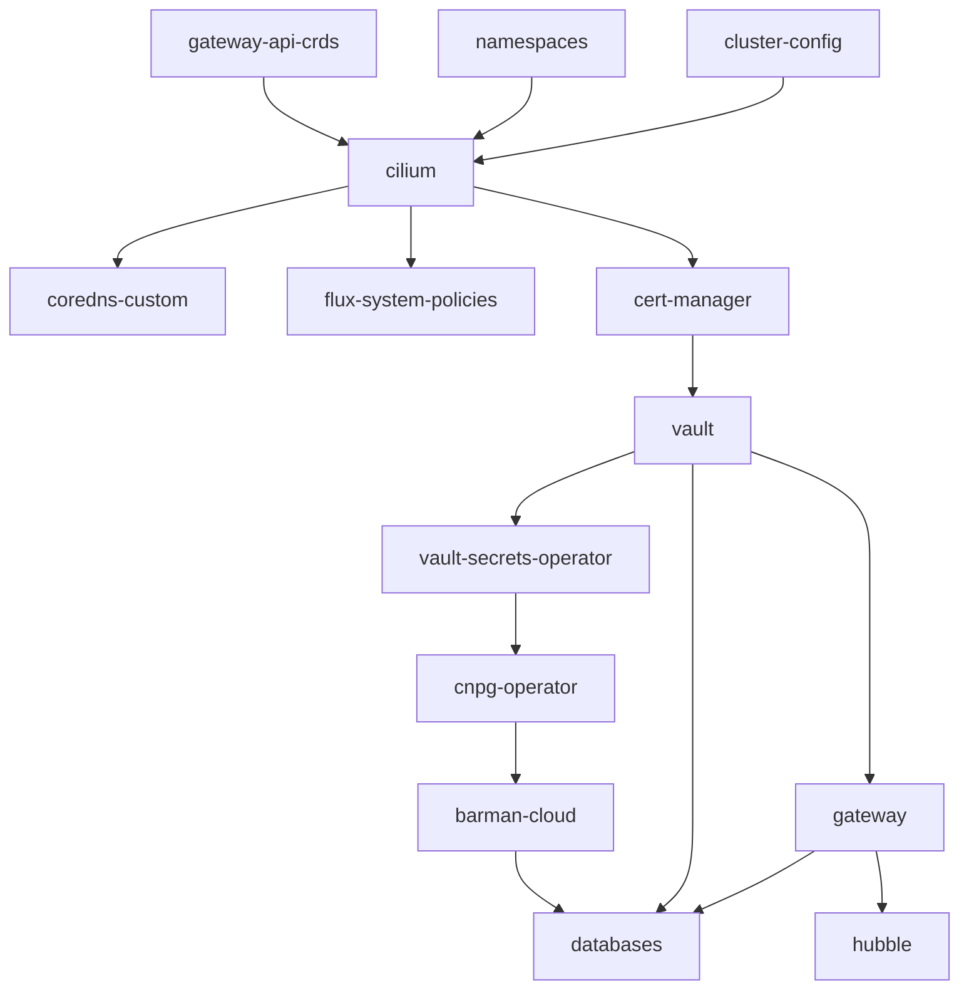

# First-Time Setup Instructions

This guide provides e for provisioning, configuring, and verifying a local single-node Kubernetes cluster tailored for data science workloads.

The process uses Ansible to provision k3s, Cilium eBPF networking, Flux GitOps controllers, in-cluster HashiCorp Vault secrets management, and OpenTofu infrastructure configurations. Once Ansible finishes, Flux takes over GitOps management of the cluster.

Once host-side prerequisites are met, running `just bootstrap` orchestrates the entire cluster lifecycle and reconciles all platform services declaratively.

## Table of Contents

* [Provisioning](#provisioning)
  * [Requirements](#requirements)
  * [Cluster Bootstrap](#cluster-bootstrap)
  * [Flux Dependency Graph](#flux-dependency-graph)
* [Verification](#verification)
  * [Verify Database Deployment](#verify-database-deployment)
  * [Test Database Connectivity](#test-database-connectivity)
  * [Verify Dynamic Credentials](#verify-dynamic-credentials)
  * [Verify Gateway Routing](#verify-gateway-routing)
  * [Hubble Observability Access](#hubble-observability-access)
  * [Verify Cluster Health](#verify-cluster-health)
  * [Verify Database Backups](#verify-database-backups)

---

## Provisioning

### Requirements

#### Host Tooling

##### Flux CLI

```bash
curl -s https://fluxcd.io/install.sh | sudo bash
flux check --pre
```

##### GitHub CLI (`gh`)

* **Ubuntu / Debian**:

  ```bash
  curl -fsSL https://cli.github.com/packages/githubcli-archive-keyring.gpg | sudo tee /usr/share/keyrings/githubcli-archive-keyring.gpg > /dev/null
  echo "deb [arch=$(dpkg --print-architecture) signed-by=/usr/share/keyrings/githubcli-archive-keyring.gpg] https://cli.github.com/packages stable main" | sudo tee /etc/apt/sources.list.d/github-cli.list > /dev/null
  sudo apt update && sudo apt install -y gh
  ```

* **Fedora / RHEL / Red Hat**:

  ```bash
  sudo dnf install -y 'dnf-command(config-manager)' 2>/dev/null || sudo dnf install -y dnf-plugins-core
  sudo dnf config-manager --add-repo https://cli.github.com/packages/rpm/gh-cli.repo
  sudo dnf install -y gh
  ```

##### Helm

```bash
curl -fsSL -o get_helm.sh https://raw.githubusercontent.com/helm/helm/main/scripts/get-helm-3
chmod +x get_helm.sh
./get_helm.sh
rm get_helm.sh
helm version
```

##### Just

* **Ubuntu / Debian**:

  ```bash
  sudo apt update && sudo apt install -y just
  ```

* **Fedora / RHEL / Red Hat**:

  ```bash
  sudo dnf install -y just
  ```

##### OpenTofu

```bash
curl --proto '=https' --tlsv1.2 -fsSL https://get.opentofu.org/install-opentofu.sh -o install-opentofu.sh
chmod +x install-opentofu.sh
sudo ./install-opentofu.sh --install-method standalone
rm install-opentofu.sh
tofu version
```

##### PostgreSQL Client (`psql`)

* **Ubuntu / Debian**:

  ```bash
  sudo apt update && sudo apt install -y postgresql-client-common postgresql-client
  ```

* **Fedora / RHEL / Red Hat**:

  ```bash
  sudo dnf install -y postgresql
  ```

#### GitHub CLI Authentication

* Authenticate with GitHub (required for `flux bootstrap github`):

  ```bash
  gh auth login
  ```

* Verify active authentication status:

  ```bash
  gh auth status
  ```

#### Host Firewall Configuration

* **Ubuntu / Debian (`ufw`)**:
  If `ufw` is active, allow Cilium's network interfaces and set default forward policy to `ACCEPT`:

  ```bash
  sudo ufw allow in on cilium_host
  sudo ufw allow in on cilium_net
  sudo ufw allow in on cilium_vxlan
  sudo ufw allow in on lxc+
  sudo sed -i 's/DEFAULT_FORWARD_POLICY="DROP"/DEFAULT_FORWARD_POLICY="ACCEPT"/' /etc/default/ufw
  sudo ufw reload
  ```

  Verify rule status:

  ```bash
  sudo ufw status verbose
  # Ensure DEFAULT_FORWARD_POLICY is accept (routed)
  # Ensure cilium_host, cilium_net, cilium_vxlan, and lxc+ are ALLOW IN
  ```

* [ ] **Reserved IP range excluded from DHCP** — the cluster claims `192.0.2.240`–`192.0.2.250` on your LAN by default (edit `terraform/cluster-config/terraform.tfvars` to change this). Confirm your router's DHCP pool doesn't hand these out, and that nothing already answers on them:

```bash
ping -c 2 -W 1 192.0.2.240
ping -c 2 -W 1 192.0.2.242
```

#### Clean Host State (if reinstalling)

If reinstalling over an existing k3s instance, uninstall the server:

```bash
/usr/local/bin/k3s-uninstall.sh
```

Verify Cilium BPF mounts are unmounted before running bootstrap (see [`troubleshooting.md`](troubleshooting.md)):

```bash
mount | grep bpf
```

#### Data Migration (if restoring an existing database)

Have your `.dump` file prepared to restore once the CNPG cluster exists (see [Verify Database Deployment](#verify-database-deployment)):

```bash
kubectl exec -i postgis-cluster-1 -n databases -- pg_restore -U postgres -d data_science --no-owner --no-privileges \
  < /mnt/your/mount/path/data_science_backup_*.dump
```

The `--no-owner --no-privileges` flags ensure restored objects inherit ownership under `app_readwrite`.

### Cluster Bootstrap

* **Step 1: Clone Repository**:

  ```bash
  git clone https://github.com/DragonBishop/data_science_cluster.git
  cd data_science_cluster
  ```

* **Step 2: Execute Ansible Bootstrap**:
  Runs the full setup via Ansible (`ansible/playbooks/k3s.yml`): k3s, Cilium, Flux, Vault, and `terraform/vault`. Idempotent and accepts optional flags (e.g. `--tags`, `--check`, `-v`):

  > [!TIP]
  > **Just Recipe:**
  >
  > ```bash
  > just bootstrap
  > ```

  > [!NOTE]
  > **Manual Shell Command:**
  >
  > ```bash
  > ansible-playbook -i ansible/inventory/hosts.ini ansible/playbooks/k3s.yml
  > ```

* **Step 3: Secure Vault Credentials & Unseal Keys**:
  The bootstrap script prompts for a GPG passphrase and an OpenTofu state-encryption passphrase, then prints the in-cluster Vault unseal keys and root token.

  > [!IMPORTANT]
  > Store the generated unseal keys and root token in a secure password manager immediately. Data cannot be recovered if these keys are lost.

  Future cluster starts (`just start` / `start-cluster.sh`) unseal Vault automatically using the GPG-encrypted keyfile (`~/.vault-keys.gpg`) written during bootstrap. Note that the cache-TTL setting in `~/.gnupg/gpg-agent.conf` only governs `gpg-agent`'s in-memory cache; on desktop environments with a keyring-integrated pinentry (e.g. `pinentry-gnome3`), the passphrase can also be stored in the OS keyring. Add `no-allow-external-cache` to `~/.gnupg/gpg-agent.conf` to disable OS keyring caching.

### Flux Dependency Graph



* `cilium` requires `gateway-api-crds` and `namespaces`.
* `coredns-custom`, `flux-system-policies`, and `cert-manager` depend on `cilium`.
* `vault` depends on `cert-manager` (for `vault-server-cert` TLS bootstrap).
* `vault-secrets-operator` and `gateway` depend on `vault` (for PKI and secrets sync).
* `cnpg-operator` depends on `vault-secrets-operator`, and `barman-cloud` depends on `cnpg-operator`.
* `hubble` depends on `gateway` (attaching the `hubble.internal` HTTPRoute).
* `databases` depends on `barman-cloud`, `gateway`, and `vault`.

---

## Verification

`just bootstrap` deploys the cluster. The checks below verify what Flux already reconciled.

### Verify Database Deployment

* **Cluster Status & WAL Archiving**:

  ```bash
  kubectl cnpg status postgis-cluster -n databases
  ```

  Verify output shows `Status: Healthy`, `1/1 ready`, and `WAL archiving: OK`.

* **CNPG Database Resource**:

  ```bash
  kubectl get database -n databases
  ```

  Verify output shows `postgis-cluster/data-science` with `status.applied: true`.

* **PostGIS Extensions**:

  ```bash
  kubectl exec -i postgis-cluster-1 -n databases -- psql -U postgres -d data_science -c '\dx'
  ```

  Verify installed extensions: `postgis`, `postgis_topology`, `postgis_tiger_geocoder`, and `fuzzystrmatch`.

* **Database Ownership**:

  ```bash
  kubectl exec -i postgis-cluster-1 -n databases -- psql -U postgres -d postgres -c \
    "SELECT datname, pg_catalog.pg_get_userbyid(datdba) FROM pg_database WHERE datname='data_science';"
  ```

  Verify database owner is `app_readwrite`.

* **Gateway TCPRoute Binding**:

  ```bash
  kubectl get tcproute -n databases postgis-external -o jsonpath='{.status.parents[*].conditions[*].message}'
  ```

  Verify condition returns `Service reference is valid`.

* **Restored Schemas (if migrating data)**:

  ```bash
  kubectl exec -i postgis-cluster-1 -n databases -- psql -U postgres -d data_science -c '\dn'
  ```

  Verify all application schemas are present.

### Test Database Connectivity

#### LAN Connectivity

Test database connectivity from your LAN workstation through the Gateway IP:

> [!TIP]
> **Just Recipe:**
>
> ```bash
> just db-connect
> ```

> [!NOTE]
> **Manual Shell Command:**
>
> ```bash
> LEASE_USER=$(kubectl get secret -n databases postgis-app-dynamic-credentials -o jsonpath='{.data.username}' | base64 -d)
> LEASE_PASS=$(kubectl get secret -n databases postgis-app-dynamic-credentials -o jsonpath='{.data.password}' | base64 -d)
> mkdir -p ~/.postgresql
> [ -f ~/.postgresql/root.crt ] || kubectl get secret postgis-server-cert -n databases -o jsonpath='{.data.ca\.crt}' | base64 -d > ~/.postgresql/root.crt
> PGPASSWORD="$LEASE_PASS" psql "host=192.0.2.240 port=5432 dbname=data_science user=$LEASE_USER sslmode=verify-full"
> ```

#### Localhost Node Connectivity

On the k3s node itself, `CiliumLocalRedirectPolicy` redirects `127.0.0.1:5432` to the CNPG primary pod:

> [!TIP]
> **Just Recipe:**
>
> ```bash
> just db-connect localhost
> ```

> [!NOTE]
> **Manual Shell Command:**
>
> ```bash
> LEASE_USER=$(kubectl get secret -n databases postgis-app-dynamic-credentials -o jsonpath='{.data.username}' | base64 -d)
> LEASE_PASS=$(kubectl get secret -n databases postgis-app-dynamic-credentials -o jsonpath='{.data.password}' | base64 -d)
> mkdir -p ~/.postgresql
> [ -f ~/.postgresql/root.crt ] || kubectl get secret postgis-server-cert -n databases -o jsonpath='{.data.ca\.crt}' | base64 -d > ~/.postgresql/root.crt
> PGPASSWORD="$LEASE_PASS" psql "host=localhost port=5432 dbname=data_science user=$LEASE_USER sslmode=verify-full"
> ```

---

### Verify Dynamic Credentials

Once the CNPG cluster is healthy and VSO reconciles `apps/databases/vso-setup.yaml`, VSO requests credentials from Vault and writes them to the `postgis-app-dynamic-credentials` Secret.

* **Check Dynamic Secret & Role Membership**:

  ```bash
  kubectl get vaultdynamicsecret postgis-app-dynamic-secret -n databases
  kubectl exec -i postgis-cluster-1 -n databases -- psql -U postgres -d postgres -c '\du'
  ```

  Verify the generated role is a member of `app_readwrite`.

* **Test Leased Database Access**:

  > [!TIP]
  > **Just Recipe:**
  >
  > ```bash
  > just db-connect
  > ```

  > [!NOTE]
  > **Manual Shell Command:**
  >
  > ```bash
  > LEASE_USER=$(kubectl get secret -n databases postgis-app-dynamic-credentials -o jsonpath='{.data.username}' | base64 -d)
  > LEASE_PASS=$(kubectl get secret -n databases postgis-app-dynamic-credentials -o jsonpath='{.data.password}' | base64 -d)
  > mkdir -p ~/.postgresql
  > [ -f ~/.postgresql/root.crt ] || kubectl get secret postgis-server-cert -n databases -o jsonpath='{.data.ca\.crt}' | base64 -d > ~/.postgresql/root.crt
  > PGPASSWORD="$LEASE_PASS" psql "host=192.0.2.240 port=5432 dbname=data_science user=$LEASE_USER sslmode=verify-full"
  > ```

---

### Verify Gateway Routing

Test Gateway listener routing and edge certificate termination:

> [!TIP]
> **Just Recipe:**
>
> ```bash
> just gateway-check
> ```

> [!NOTE]
> **Manual Shell Command:**
>
> ```bash
> curl -v --resolve hubble.internal:443:192.0.2.240 \
>   --cacert <(kubectl get secret -n gateway internal-edge-cert -o jsonpath='{.data.ca\.crt}' | base64 -d) \
>   https://hubble.internal/
> ```

Verify that the page responds and the certificate chains to `vault-pki-issuer`'s CA (`internal-edge-cert`).

---

### Hubble Observability Access

Verify network visibility and access the Hubble UI / CLI:

* **Web UI Access**: `just hubble-ui` port-forwards to `localhost:12000` and opens the UI in your default browser.
* **CLI Flow Streaming**: `just hubble status` and `just hubble observe --follow` stream flows from Hubble Relay over mTLS (port 4245).

---

### Verify Cluster Health

Check the overall operational status and reconciliation health of all cluster components:

> [!TIP]
> **Just Recipe:**
>
> ```bash
> just status
> ```

> [!NOTE]
> **Manual Shell Command:**
>
> ```bash
> flux get kustomizations
> ```

---

### Verify Database Backups

Verify automated backup schedules and trigger an on-demand backup to SeaweedFS S3:

* **Verify Scheduled Backups**:

  ```bash
  kubectl get scheduledbackup -n databases
  ```

  Verify `suspend: false` and scheduled backup intervals.

* **Trigger Manual Test Backup**:

  ```bash
  kubectl cnpg backup postgis-cluster -n databases
  ```

* **Confirm Backup Status**:

  ```bash
  kubectl cnpg status postgis-cluster -n databases
  ```

  Verify `Last Successful Backup` timestamp updates to the current time.
