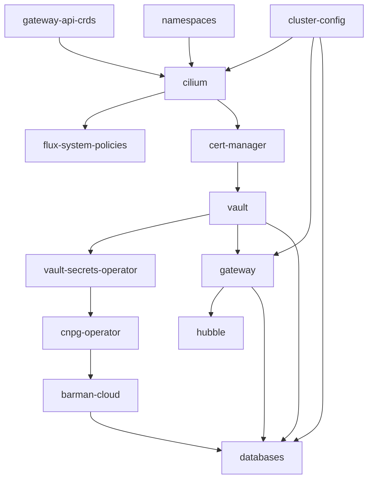

# First-Time Setup Instructions

`just bootstrap` runs the full first-time setup once the Requirements below are satisfied.

## Table of Contents

* [Requirements](#requirements)
* [Running the Bootstrap Script](#running-the-bootstrap-script)
* [Reference](#reference)
  * [Flux Dependency Graph](#flux-dependency-graph)
  * [Hubble Access](#hubble-access)
* [Verification](#verification)
  * [Verify Database Deployment](#verify-database-deployment)
  * [Verify Dynamic Credentials](#verify-dynamic-credentials)
  * [Final Checks](#final-checks)

## Requirements

* [ ] **Host tooling** — Flux CLI, OpenTofu, Helm, GitHub CLI (`gh`), PostgreSQL client (`psql`), `just`:

  ```bash
  sudo apt install -y postgresql-client-common postgresql-client just
  curl -s https://fluxcd.io/install.sh | sudo bash
  flux check --pre

  curl --proto '=https' --tlsv1.2 -fsSL https://get.opentofu.org/install-opentofu.sh -o install-opentofu.sh
  chmod +x install-opentofu.sh
  sudo ./install-opentofu.sh --install-method standalone
  rm install-opentofu.sh
  tofu version

  curl -fsSL -o get_helm.sh https://raw.githubusercontent.com/helm/helm/main/scripts/get-helm-3
  chmod +x get_helm.sh
  ./get_helm.sh
  rm get_helm.sh
  helm version

  curl -fsSL https://cli.github.com/packages/githubcli-archive-keyring.gpg | sudo tee /usr/share/keyrings/githubcli-archive-keyring.gpg > /dev/null
  echo "deb [arch=$(dpkg --print-architecture) signed-by=/usr/share/keyrings/githubcli-archive-keyring.gpg] https://cli.github.com/packages stable main" | sudo tee /etc/apt/sources.list.d/github-cli.list > /dev/null
  sudo apt update && sudo apt install -y gh
  ```

* [ ] **GitHub CLI authenticated** — `gh auth login`. Used by the bootstrap script for `flux bootstrap github`.

* [ ] **Host firewall (`ufw`)** — if `ufw` is active, allow Cilium's network interfaces and set the default forward policy to `ACCEPT`:

  ```bash
  sudo ufw allow in on cilium_host
  sudo ufw allow in on cilium_net
  sudo ufw allow in on cilium_vxlan
  sudo ufw allow in on lxc+
  sudo sed -i 's/DEFAULT_FORWARD_POLICY="DROP"/DEFAULT_FORWARD_POLICY="ACCEPT"/' /etc/default/ufw
  sudo ufw reload
  ```

  Verify:

  ```bash
  sudo ufw status verbose
  # Ensure DEFAULT_FORWARD_POLICY is accept (routed)
  # Ensure cilium_host, cilium_net, cilium_vxlan, and lxc+ are ALLOW IN
  ```

  **Fedora (`firewalld`)** — `ufw` isn't present on Fedora; `firewalld` serves the same role. Cilium's per-pod interfaces get random names each time (`lxcXXXX`), which `firewalld` can't wildcard-match the way `ufw` does, so allow forwarding/masquerade on your active zone instead of trying to allow interfaces by name:

  ```bash
  sudo firewall-cmd --permanent --zone="$(firewall-cmd --get-default-zone)" --add-port=443/tcp
  sudo firewall-cmd --permanent --zone="$(firewall-cmd --get-default-zone)" --add-masquerade
  sudo firewall-cmd --reload
  ```

  This is best-effort, not a guarantee — desktop-oriented zones (e.g. Fedora Workstation's default zone) are usually already permissive enough (`forward: yes`, wide ephemeral-port ranges) that this is the only real gap. If LAN clients still can't reach the Gateway after bootstrap, check `firewall-cmd --list-all` against what Cilium actually opened at runtime.

  Verify:

  ```bash
  sudo firewall-cmd --list-all
  # Ensure forward: yes, masquerade: yes, and 443/tcp is listed under ports
  ```

* [ ] **Reserved IP range excluded from DHCP** — the cluster claims `192.0.2.240`–`192.0.2.250` on your LAN by default (edit `infrastructure/cluster-config/cluster-config.yaml` to change this). Confirm your router's DHCP pool doesn't hand these out, and that nothing already answers on them:

  ```bash
  ping -c 2 -W 1 192.0.2.240
  ping -c 2 -W 1 192.0.2.242
  ```

* [ ] **If migrating existing data, have your backup dump ready.** You'll run this once the CNPG cluster exists (see [Verify Database Deployment](#verify-database-deployment)):

  ```bash
  kubectl exec -i postgis-cluster-1 -n databases -- pg_restore -U postgres -d data_science --no-owner --no-privileges \
    < /mnt/your/mount/path/data_science_backup_*.dump
  ```

  The `--no-owner --no-privileges` flags ensure restored objects inherit ownership under `app_readwrite`.

## Running the Bootstrap Script

Clone the repository:

```bash
git clone https://github.com/DragonBishop/data_science_cluster.git
cd data_science_cluster
```

`just bootstrap` (`src/bash/bootstrap-cluster.sh`) runs the full first-time setup — k3s, Cilium, Flux, the in-cluster Vault, `terraform/vault`. It's idempotent — safe to re-run:

```bash
just bootstrap
```

It fires two native prompts (a GPG passphrase, an OpenTofu state-encryption passphrase), then reprints the in-cluster Vault's unseal keys and root token — **printed the moment they're generated and unrecoverable if lost.**

> [!IMPORTANT]
> Store the generated unseal keys and root token in a secure password manager immediately. Data cannot be recovered if these keys are lost.

> [!NOTE]
> The in-cluster Vault unseals itself on future starts via a GPG-encrypted keyfile (`~/.vault-keys.gpg`) written during this step — see `start-cluster.sh`.

> [!NOTE]
> The GPG keyfile's `~/.gnupg/gpg-agent.conf` cache-TTL setting only governs gpg-agent's own memory cache. On desktops with a keyring-integrated pinentry (e.g. `pinentry-gnome3`), the passphrase can also be saved to the OS keyring, which bypasses that setting. Add `no-allow-external-cache` to the same file to stop that.

> [!NOTE]
> If reinstalling on a host with an existing k3s installation, run `/usr/local/bin/k3s-uninstall.sh` and verify Cilium BPF mounts are unmounted (`mount | grep bpf`; see `troubleshooting.md`) before re-running `just bootstrap`. Reinstalling wipes in-cluster Vault and PVC data.

## Reference

### Flux Dependency Graph



* `cilium` requires `gateway-api-crds`, `namespaces`, and `cluster-config` (for `GATEWAY_IP`/`COREDNS_LAN_IP` substitution).
* `flux-system-policies` and `cert-manager` depend on `cilium`.
* `vault` depends on `cert-manager` (for `vault-server-cert` TLS bootstrap).
* `vault-secrets-operator` and `gateway` depend on `vault` (for PKI and secrets sync).
* `cnpg-operator` depends on `vault-secrets-operator`, and `barman-cloud` depends on `cnpg-operator`.
*`hubble` depends on `gateway` (attaching the `hubble.internal` HTTPRoute).
* `databases` depends on `barman-cloud`, `gateway`, and `vault`.

### Hubble Access

* `just hubble-ui` port-forwards to `localhost:12000` and opens the UI in a browser.
* `just hubble status` and `just hubble observe --follow` connect to Hubble Relay over mTLS (port 4245).

---

## Verification

`just bootstrap` deploys the cluster. The checks below verify what Flux already reconciled.

### Verify Database Deployment

```bash
kubectl cnpg status postgis-cluster -n databases
# Status: Healthy, 1/1 ready, WAL archiving OK

kubectl get database -n databases
# Status: postgis-cluster/data-science, status.applied: true

kubectl exec -i postgis-cluster-1 -n databases -- psql -U postgres -d data_science -c '\dx'
# Verify extensions: postgis, postgis_topology, postgis_tiger_geocoder, fuzzystrmatch

kubectl exec -i postgis-cluster-1 -n databases -- psql -U postgres -d postgres -c \
  "SELECT datname, pg_catalog.pg_get_userbyid(datdba) FROM pg_database WHERE datname='data_science';"
# Owner should be app_readwrite

kubectl get tcproute -n databases postgis-external -o jsonpath='{.status.parents[*].conditions[*].message}'
# "Service reference is valid"
```

If you restored a dump via the [Requirements](#requirements) `pg_restore` command, also verify the restored schemas:

```bash
kubectl exec -i postgis-cluster-1 -n databases -- psql -U postgres -d data_science -c '\dn'
# Verify expected schemas are listed
```

### Test LAN Database Connectivity

```bash
just db-connect
```

Or shell command:

```bash
LEASE_USER=$(kubectl get secret -n databases postgis-app-dynamic-credentials -o jsonpath='{.data.username}' | base64 -d)
LEASE_PASS=$(kubectl get secret -n databases postgis-app-dynamic-credentials -o jsonpath='{.data.password}' | base64 -d)
mkdir -p ~/.postgresql
[ -f ~/.postgresql/root.crt ] || kubectl get secret postgis-server-cert -n databases -o jsonpath='{.data.ca\.crt}' | base64 -d > ~/.postgresql/root.crt
PGPASSWORD="$LEASE_PASS" psql "host=192.0.2.240 port=5432 dbname=data_science user=$LEASE_USER sslmode=verify-full"
```

### Test Localhost Database Connectivity

On the k3s node itself, `CiliumLocalRedirectPolicy` redirects `127.0.0.1:5432` to the CNPG primary pod:

```bash
just db-connect localhost
```

Or shell command (same as above, with `host=localhost`):

```bash
LEASE_USER=$(kubectl get secret -n databases postgis-app-dynamic-credentials -o jsonpath='{.data.username}' | base64 -d)
LEASE_PASS=$(kubectl get secret -n databases postgis-app-dynamic-credentials -o jsonpath='{.data.password}' | base64 -d)
mkdir -p ~/.postgresql
[ -f ~/.postgresql/root.crt ] || kubectl get secret postgis-server-cert -n databases -o jsonpath='{.data.ca\.crt}' | base64 -d > ~/.postgresql/root.crt
PGPASSWORD="$LEASE_PASS" psql "host=localhost port=5432 dbname=data_science user=$LEASE_USER sslmode=verify-full"
```

Reachable only from the node itself, not other LAN machines.

---

### Verify Dynamic Credentials

Once the CNPG cluster is healthy and VSO reconciles `apps/databases/vso-setup.yaml`, VSO requests credentials from Vault and writes them to the `postgis-app-dynamic-credentials` Secret.

```bash
kubectl get vaultdynamicsecret postgis-app-dynamic-secret -n databases
kubectl exec -i postgis-cluster-1 -n databases -- psql -U postgres -d postgres -c '\du'
# Issued role should show: Member of: app_readwrite

just db-connect
```

Or shell command:

```bash
LEASE_USER=$(kubectl get secret -n databases postgis-app-dynamic-credentials -o jsonpath='{.data.username}' | base64 -d)
LEASE_PASS=$(kubectl get secret -n databases postgis-app-dynamic-credentials -o jsonpath='{.data.password}' | base64 -d)
mkdir -p ~/.postgresql
[ -f ~/.postgresql/root.crt ] || kubectl get secret postgis-server-cert -n databases -o jsonpath='{.data.ca\.crt}' | base64 -d > ~/.postgresql/root.crt
PGPASSWORD="$LEASE_PASS" psql "host=192.0.2.240 port=5432 dbname=data_science user=$LEASE_USER sslmode=verify-full"
```

> [!NOTE]
> Run this verification command from the host, as `~/.postgresql/root.crt` is located in the host's home directory.

---

### Final Checks

Verify cluster health, backups, and Flux status:

```bash
kubectl cnpg status postgis-cluster -n databases        # Healthy, WAL archiving OK
kubectl get scheduledbackup -n databases                 # suspend: false
kubectl cnpg backup postgis-cluster -n databases          # Manual backup test to SeaweedFS S3
kubectl cnpg status postgis-cluster -n databases          # Verify Last Successful Backup timestamp updates
flux get kustomizations                                   # All Kustomizations Ready
```

Verify Gateway routing and TLS termination:

```bash
curl -v --resolve hubble.internal:443:192.0.2.240 \
  --cacert <(kubectl get secret -n gateway internal-edge-cert -o jsonpath='{.data.ca\.crt}' | base64 -d) \
  https://hubble.internal/
```

Verify that the page responds and the certificate chains to `vault-pki-issuer`'s CA. `internal-edge-cert` is issued by `vault-pki-issuer` (Vault's PKI secrets engine); `vault-server-cert` is a separate, self-signed CA used only for Vault's own API TLS, and won't verify this connection.
