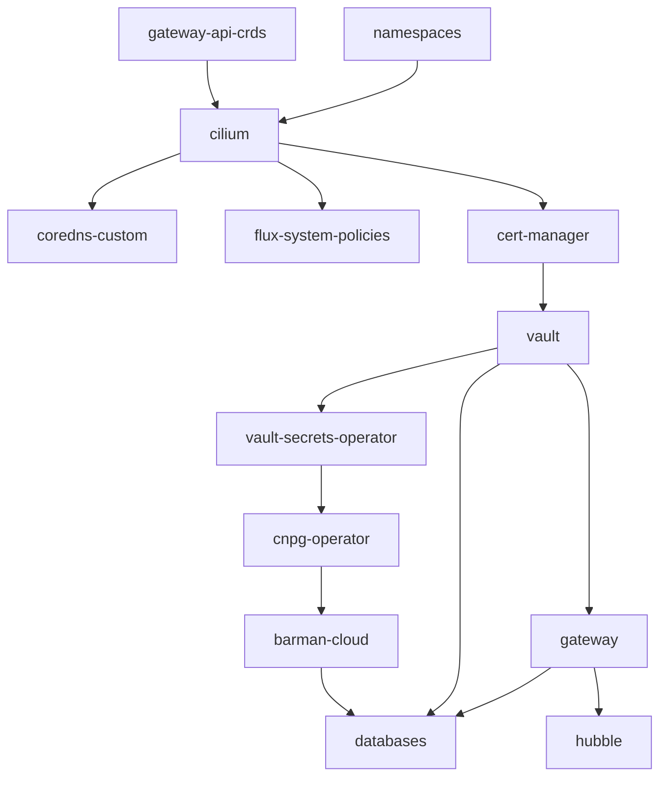

# First-Time Setup Instructions

This setup workflow is designed to be completed sequentially. Deviating from this order may result in initialization failures.

## Prerequisites

**Host Tooling:** Ensure the following CLI tools are installed on the host:

- Flux CLI
- OpenTofu
- PostgreSQL client (`psql`)
- GitHub CLI (`gh`)
- `just`

```bash
sudo apt install -y postgresql-client-common postgresql-client just
curl -s https://fluxcd.io/install.sh | sudo bash
flux check --pre
gh auth status

curl --proto '=https' --tlsv1.2 -fsSL https://get.opentofu.org/install-opentofu.sh -o install-opentofu.sh
chmod +x install-opentofu.sh
sudo ./install-opentofu.sh --install-method standalone
rm install-opentofu.sh
tofu version
```

**Host Firewall (`ufw`):** If `ufw` is active, configure it to allow Cilium network interfaces and set the default forward policy to `ACCEPT`:

```bash
sudo ufw allow in on cilium_host
sudo ufw allow in on cilium_net
sudo ufw allow in on cilium_vxlan
sudo ufw allow in on lxc+
sudo sed -i 's/DEFAULT_FORWARD_POLICY="DROP"/DEFAULT_FORWARD_POLICY="ACCEPT"/' /etc/default/ufw
sudo ufw reload
```

**Verify Firewall Configuration:**

```bash
sudo ufw status verbose
# Ensure DEFAULT_FORWARD_POLICY is accept (routed)
# Ensure cilium_host, cilium_net, cilium_vxlan, and lxc+ are ALLOW IN
```

---

## 1. Clone Repo and Install k3s

- **Clone the repository:**

```bash
git clone https://github.com/DragonBishop/data_science_cluster.git
cd data_science_cluster
```

> [!NOTE]
> If reinstalling on a host with an existing k3s installation, run `/usr/local/bin/k3s-uninstall.sh` and verify Cilium BPF mounts are unmounted (`mount | grep bpf`; see `troubleshooting.md`). Reinstalling wipes in-cluster Vault and PVC data.

- **Configure Network Values:**

The cluster uses network values defined in a `cluster-config` Secret in the `flux-system` namespace. These values are substituted into manifests during Flux reconciliation (`postBuild.substituteFrom` in `clusters/local/*.yaml`). The Secret is managed via OpenTofu from `terraform/cluster-config/terraform.tfvars` (gitignored).

| Target File | Variable | Description |
| --- | --- | --- |
| `infrastructure/cilium/lan-lb-pool.yaml` | `${GATEWAY_IP}` | Load balancer IP pool start address |
| `infrastructure/gateway/gateway.yaml` | `${GATEWAY_IP}` | Shared Gateway IP address |
| `apps/databases/postgis-tls.yaml` | `${GATEWAY_IP}` | Certificate SAN |
| `infrastructure/coredns-custom/coredns-lan-service.yaml` | `${COREDNS_LAN_IP}` | LAN-facing IP for CoreDNS |
| `infrastructure/coredns-custom/coredns-custom.yaml` | `${GATEWAY_IP}` | Gateway IP target for `*.internal` DNS resolution |
| `infrastructure/cilium/cilium-release.yaml` | `${CILIUM_VERSION}` | Cilium HelmRelease chart version |
| `infrastructure/vault/vault-networkpolicy.yaml` | `${HOST_IP}` | Node IP address for Vault egress to host Transit Vault |

To update any of these values, modify `terraform.tfvars` and re-apply with `tofu apply`.

In-cluster CoreDNS (`kube-system`) resolves `*.internal` for LAN clients via `infrastructure/coredns-custom/` alongside standard cluster DNS.

Verify that the reserved IP range (`192.0.2.240`–`192.0.2.250`) is excluded from your router's DHCP pool:

```bash
ping -c 2 -W 1 192.0.2.240
ping -c 2 -W 1 192.0.2.242
```

- **Install k3s:**

Cilium replaces kube-proxy, Traefik, servicelb, and the default CNI. Configure `/etc/rancher/k3s/config.yaml` with the necessary flags before running the installer:

```bash
just k3s-config

curl -sfL https://get.k3s.io | sh -

kubectl get nodes
```

`just k3s-config` installs `src/k3s/config.yaml` to `/etc/rancher/k3s/config.yaml`.

- **Check:** Verify the node appears with status `NotReady` (expected until Cilium CNI is installed).

- **Create the `cluster-config` Secret:**

```bash
just cluster-config
```

Opens `terraform/cluster-config/terraform.tfvars` (pre-filled with a detected `host_ip`) for review, then applies it.

- **Check:**

```bash
kubectl get secret cluster-config -n flux-system
```

---

## 2. Cilium

Install the Gateway API Custom Resource Definitions (CRDs) using server-side apply:

```bash
kubectl apply --server-side -f infrastructure/gateway-api-crds/standard-install.yaml
```

Install the Cilium Helm chart matching the version declared in `infrastructure/cilium/cilium-release.yaml`:

```bash
just cilium-install
```

**Check:**

```bash
kubectl get nodes                          # Status: Ready
cilium status --wait
kubectl -n kube-system exec ds/cilium -- cilium-dbg status | grep KubeProxyReplacement
# KubeProxyReplacement: True

kubectl -n kube-system get cm cilium-config -o yaml | grep enable-l2-announcements
kubectl -n kube-system exec ds/cilium -- cilium-dbg status --verbose | grep -A2 l2-responder
# enable-l2-announcements: "true", l2-responder [OK] Running
```

---

## 3. Deploy the Host-Level Transit Vault

The host Transit Vault runs directly on the host system to provide auto-unseal capabilities for the in-cluster Vault.

```bash
wget -O- https://apt.releases.hashicorp.com/gpg | sudo gpg --dearmor -o /usr/share/keyrings/hashicorp-archive-keyring.gpg

echo "deb [signed-by=/usr/share/keyrings/hashicorp-archive-keyring.gpg] https://apt.releases.hashicorp.com $(lsb_release -cs) main" | sudo tee /etc/apt/sources.list.d/hashicorp.list

sudo apt update && sudo apt install -y vault
```

Generate the TLS certificate for the host Transit Vault:

```bash
just vault-host-tls
```

Add `127.0.0.1 vault.local` to `/etc/hosts`.

Configure `/etc/vault.d/vault.hcl`:

```hcl
api_addr = "https://vault.local:8200"

listener "tcp" {
  address       = "0.0.0.0:8200"
  tls_cert_file = "/opt/vault/tls/tls.crt"
  tls_key_file  = "/opt/vault/tls/tls.key"
}
```

Enable the service, initialize Vault, unseal it, and log in:

```bash
just vault-host-init
```

> [!CRITICAL]
> Store the generated 5 unseal keys and initial root token in a secure password manager immediately. Data cannot be recovered if these keys are lost.

**Automate Future Host Vault Unsealing:**

`src/bash/start-cluster.sh` can automatically decrypt keys from a GPG-encrypted keyfile.

Generate the encrypted keyfile using a temporary RAM disk, and configure `gpg-agent` to expire passphrase caching immediately:

```bash
just vault-keyfile
```

---

## 4. Bootstrap Flux

Bootstrap Flux into the repository:

```bash
flux bootstrap github \
  --owner=DragonBishop \
  --repository=data_science_cluster \
  --branch=main \
  --path=clusters/local \
  --personal
```

Flux synchronizes the repository and reconciles the Kustomization dependency graph:



- `cilium` requires `gateway-api-crds` and `namespaces`.
- `coredns-custom`, `flux-system-policies`, and `cert-manager` depend on `cilium`.
- `vault` depends on `cert-manager` (for `vault-server-cert` TLS bootstrap).
- `vault-secrets-operator` and `gateway` depend on `vault` (for PKI and secrets sync).
- `cnpg-operator` depends on `vault-secrets-operator`, and `barman-cloud` depends on `cnpg-operator`.
- `hubble` depends on `gateway` (attaching the `hubble.internal` HTTPRoute).
- `databases` depends on `barman-cloud`, `gateway`, and `vault`.

**Check:**

```bash
flux get kustomizations
kubectl get pods -n flux-system   # All Running
kubectl get ns
# Namespaces: vault, vso-system, cnpg-system, databases, cert-manager, gateway
```

---

## 5. Deploy In-Cluster HashiCorp Vault

Configure the host Transit Vault resources required for in-cluster auto-unsealing.

Unseal the host Transit Vault if needed, then apply the `terraform/vault-transit-bootstrap` module to configure the transit mount, autounseal key, policy, periodic orphan token, and Kubernetes Secret objects in the `vault` namespace:

```bash
just vault-transit-bootstrap
```

**Configure Continuous Token Renewal:**

Set up the `vault-agent-autounseal` systemd service to renew the transit auto-unseal token periodically:

```bash
just vault-autounseal-agent
```

**Reconcile and Initialize the In-Cluster Vault:**

```bash
flux reconcile kustomization vault
kubectl get pods -n vault -w
```

Initialize the in-cluster Vault instance. This returns recovery keys and a root token:

```bash
kubectl exec -n vault vault-0 -- vault operator init
```

> [!IMPORTANT]
> Save the recovery keys and root token in your password manager immediately.

**Configure Vault Engines and Policies:**

Configure KV secrets, Kubernetes authentication, policies, the 2-tier PKI engine, and database secrets engine via `terraform/vault/`, then verify the result:

```bash
just vault-engines
```

Ensure the printed tfstate excerpt is encrypted (non-plaintext output). Exported environment variables (token, passphrase, generated secrets) are unset automatically at the end.

---

## 6. Flux Kustomization Rollout

Trigger reconciliation of the remaining cluster resources:

```bash
flux reconcile kustomization flux-system --with-source
```

**Check:**

```bash
flux get kustomizations
```

```bash
helm list -n kube-system  
# Verify cilium release is updated (REVISION 2)

kubectl get ciliumloadbalancerippool
# Verify lan-ip-pool shows allocated IPs (internal-gateway, coredns-external)

kubectl get gateway -n gateway internal-gateway -o wide
# Status: PROGRAMMED True, IP: 192.0.2.240

kubectl get svc -n kube-system coredns-external
# EXTERNAL-IP: 192.0.2.242

# Restart CoreDNS once to mount custom ConfigMap:
kubectl rollout restart deployment coredns -n kube-system

kubectl wait --for=condition=Available --timeout=120s -n cert-manager deployment --all

kubectl get clusterissuer vault-pki-issuer   # Ready

kubectl rollout status deployment -n cnpg-system plugin-barman-cloud

kubectl get svc,pods -n databases -l app.kubernetes.io/instance=seaweedfs --show-labels
```

```bash
kubectl cnpg status postgis-cluster -n databases
# Status: Healthy, 1/1 Ready, WAL archiving OK
```

```bash
helm get values cilium -n kube-system   # Verify hubble configuration is present
kubectl get pods -n kube-system -l 'k8s-app in (hubble-relay,hubble-ui)'
# Status: Running (1/1 and 2/2)

kubectl get httproute -n kube-system hubble-ui -o jsonpath='{.status.parents[*].conditions[*].message}'
# "Accepted" and "Service reference is valid"
```

If the Hubble configuration is not yet reflected in `helm get values`, trigger a reconciliation:

```bash
flux reconcile helmrelease cilium -n kube-system --timeout 5m
```

**Hubble Access:**

- `just hubble-ui` port-forwards to `localhost:12000` and opens the UI in a browser.
- `just hubble status` and `just hubble observe --follow` connect to Hubble Relay over mTLS (port 4245).

---

## 7. Deploy CloudNativePostgreSQL Database Server with PostGIS

### Verify Database Deployment

```bash
kubectl cnpg status postgis-cluster -n databases
# Status: Healthy, 1/1 ready, WAL archiving OK

kubectl get database -n databases
# Status: postgis-cluster/data-science, status.applied: true

kubectl exec -i postgis-cluster-1 -n databases -- psql -U postgres -d data_science -c '\dx'
# Verify extensions: postgis, postgis_topology, postgis_tiger_geocoder, fuzzystrmatch

kubectl exec -i postgis-cluster-1 -n databases -- psql -U postgres -d postgres -c \
  "SELECT datname, pg_catalog.pg_get_userbyid(datdba) FROM pg_database WHERE datname='data_science';"
# Owner should be app_readwrite

kubectl get tcproute -n databases postgis-external -o jsonpath='{.status.parents[*].conditions[*].message}'
# "Service reference is valid"
```

### Test LAN Database Connectivity

```bash
just db-connect
```

### Test Localhost Database Connectivity

On the k3s node itself, `CiliumLocalRedirectPolicy` redirects `127.0.0.1:5432` to the CNPG primary pod:

```bash
just db-connect localhost
```

Reachable only from the node itself, not other LAN machines.

### Migrate Existing PostgreSQL Data

If migrating data from an existing database dump, restore it into the new cluster:

```bash
kubectl exec -i postgis-cluster-1 -n databases -- pg_restore -U postgres -d data_science --no-owner --no-privileges \
  < /mnt/your/mount/path/data_science_backup_*.dump
```

The `--no-owner --no-privileges` flags ensure restored objects inherit ownership under `app_readwrite`.

Verify restored schemas:

```bash
kubectl exec -i postgis-cluster-1 -n databases -- psql -U postgres -d data_science -c '\dn'
# Verify expected schemas are listed
```

---

## 8. Dynamic Database Role and Access Verification

Once the CNPG cluster is healthy and VSO reconciles `apps/databases/vso-setup.yaml`, VSO requests credentials from Vault and writes them to the `postgis-app-dynamic-credentials` Secret.

### Verify Dynamic Credentials

```bash
kubectl get vaultdynamicsecret postgis-app-dynamic-secret -n databases
kubectl exec -i postgis-cluster-1 -n databases -- psql -U postgres -d postgres -c '\du'
# Issued role should show: Member of: app_readwrite

just db-connect
```

> [!NOTE]
> Run this verification command from the host, as `~/.postgresql/root.crt` is located in the host's home directory.

---

## 9. Full End-to-End Verification

Verify cluster health, backups, and Flux status:

```bash
kubectl cnpg status postgis-cluster -n databases        # Healthy, WAL archiving OK
kubectl get scheduledbackup -n databases                 # suspend: false
kubectl cnpg backup postgis-cluster -n databases          # Manual backup test to SeaweedFS S3
kubectl cnpg status postgis-cluster -n databases          # Verify Last Successful Backup timestamp updates
flux get kustomizations                                   # All Kustomizations Ready
```

Verify Gateway routing and TLS termination:

```bash
curl -v --resolve hubble.internal:443:192.0.2.240 \
  --cacert <(kubectl get secret -n gateway internal-edge-cert -o jsonpath='{.data.ca\.crt}' | base64 -d) \
  https://hubble.internal/
```

Verify that the page responds and the certificate chains to `vault-pki-issuer`'s CA. `internal-edge-cert` is issued by `vault-pki-issuer` (Vault's PKI secrets engine); `vault-server-cert` is a separate, self-signed CA used only for Vault's own API TLS, and won't verify this connection.
